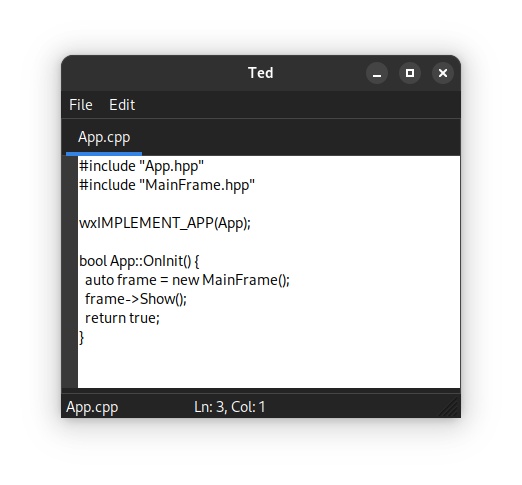

# Ted

Just a lightweight text editor built with C++ and wxWidgets.



## Building from Source

### Prerequisites

- C++20 compatible compiler
- CMake
- wxWidgets library

### Build Instructions

1. Clone the repository:

   ```bash
   git clone https://github.com/VasilisMylonas/ted.git
   cd ted
   ```

2. Create a build directory and navigate to it:

   ```bash
   mkdir -p build
   cd build
   ```

3. Configure with CMake and build:

   ```bash
   cmake ..
   cmake --build .
   ```

4. Run the editor:

   ```bash
   ./ted
   ```

## License

[MIT License](LICENSE.txt)
